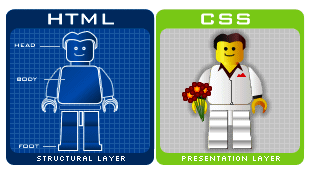

<!--
  UPDATE THIS:

  
-->

## Guide for attendees who are starting to learn HTML/CSS.

!> For **newbies / beginners** please read, understand and follow this starter pack. 
It might take 2-3 hrs or more to finish this. Please try your best to follow all the activities, we know you can do it. :)

!> For **attendees who already knows the _basics/fundamentals of HTML & CSS_**, you don’t need to read it all but we recommend to do the final activity - My First Blog Site before attending the study group. 

### Creating your Personal Blog Site

We will guide you to your journey of learning HTML/CSS and our objective is to create your **first Personal Blog Site**. 

!> Note:
Please read all the supporting references in this starter pack. Explore the links provided for further reading.  Let’s practice ourselves in reading the documentation. It will help you to learn more :) 

### What is a Blog?

“A blog (shortening of “weblog”) is an online journal or informational website displaying information in the reverse chronological order, with latest posts appearing first. It is a platform where a writer or even a group of writers share their views on an individual subject.” 
Source: https://firstsiteguide.com/what-is-blog/ 

## My First Hello World! 

### Try it Yourself: My First Hello World! 

1. Open a text editor. (Notepad, Notepad++, Sublime or any text editor that you have).
2. Type the code below in your text editor:
```
<html>
	<head>
		<title>My First Hello World</title>
</head>
<body>
	<h1> Hello World!</h1>
	<p> This is my first paragraph! </p>
</body>	
</html>
```
3. Save it as MyFirstHelloWorld.html
4. Open it with any browser that you have. (Google Chrome, Firefox, IE, etc)

Congratulations on your First Hello World!
You successfully run your first HTML page. :) 


### Understanding the Code

Let’s check and understand the codes from your MyFirstHelloWorld.html. 

HTML stands for **Hyper Text Markup Language**.
In web, webpages are made up of **HTML** and **CSS**. 



Photo credit © https://sites.google.com/a/st-anns.ca/mrs-nichol/html/html-and-css 


HTML provides the structure, while CSS provides the appearance.
And the structure is composed of elements and tags. 

Going back to our code, each words that starts with ‘<’ and ends with ‘>’ are **tags**.

**HTML tags** are element names surrounded by angle brackets:
<tagname>content goes here...</tagname>

Example:


Photo Credit © https://learn.shayhowe.com 

In the example above:
* The **HTML `<a>` element (or anchor element)** creates a hyperlink to link one page or file to another.
* The _opening tag_ is **`<a href=”http://shayhowe.com/”>`**. Opening tag is used to start an element. 
* The _content_ is **'Shay Howe'**. It is the information displayed in your browser. 
* The _closing tag_ is **`</a>`**. Closing tag is used to end an element. 
* '**href=”http://shayhowe.com”**' is an example of an attribute 'href' with value of 'http://shayhowe.com'. 

